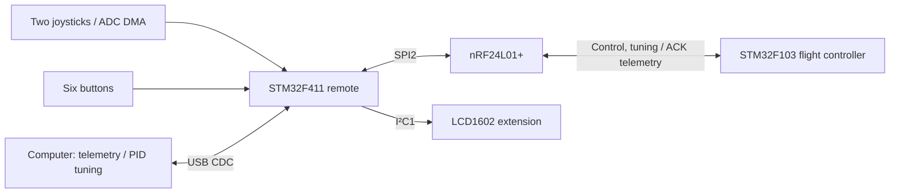

# STM32F411 Wireless Flight Remote Controller

[繁體中文](README.md) | **English**

A wireless remote built with **STM32F411CEU6, FreeRTOS, nRF24L01+, and two joysticks**, designed for the [STM32F103 Flight Controller](https://github.com/ZHANG-XICHANG/stm32f103-flight-controller). It transmits four control channels and button commands, forwards flight telemetry to a computer over USB CDC, and relays PID tuning commands to the flight controller.


## Features

| Feature | Current implementation |
| --- | --- |
| Joystick input | Four ADC channels with DMA, low-pass filtering, center dead zones, and value mapping |
| Buttons | Independent debouncing for six buttons, pitch/roll trim, and arm/disarm commands at low throttle |
| Wireless control | 17-byte control packets, automatic ACK, hardware retries, timeouts, and SPI error recovery |
| Telemetry | 31-byte ACK telemetry forwarded over USB: attitude, angular rate, PID values, and four PWM outputs |
| Computer tuning | Relays PID parameters and telemetry axis selection; reports application results or timeouts |
| LCD extension | Firmware support for an I²C LCD1602 displaying Connected/Disconnected |

This repository contains the remote firmware. The companion flight controller repository contains the flight firmware and Python telemetry and tuning tools.

## System architecture



| FreeRTOS task | Priority | Configured period | Responsibility |
| --- | --- | --- | --- |
| CommunicationTa | High | 6 ms | Radio initialization, control/tuning transmission, and ACK reception |
| JoystickTask | AboveNormal | 6 ms | Processes joystick samples and updates control data |
| ButtonTask | Normal | 10 ms | Debouncing, trim, and arm/disarm events |
| DisplayTask | BelowNormal | 50 ms | Updates the LCD connection status |
| USBDebugTask | Low1 | Blocks on the message queue | USB output; waits 1 tick before retrying an unsuccessful transfer |

These are configured periods, not measured execution times or guaranteed packet rates. Radio initialization and error recovery introduce additional delays.

## Hardware and power

| Component | Quantity / configuration |
| --- | --- |
| STM32F411CEU6 development board | 1, with a USB Type-C connector |
| Ebyte E01-2G4M27D radio module | 1, nRF24L01+ based, SPI interface |
| Dual-axis joystick module | 2, providing four analog inputs |
| Push button | 6 |
| LCD1602 with PCF8574 I²C backpack | Firmware-supported extension; not included in the basic hardware list for the current build |

Power connections in the author's build:

- Power enters through the F411 board's **USB Type-C** connector.
- The E01-2G4M27D radio module uses **5V**.
- Both joystick modules use **3.3V**.

The [official E01-2G4M27D specifications](https://www.ebyte.com/product/449.html) list a **2.5–5.5V** supply range, which includes the 5V used here. The communication level is typically **3.3V**, with a listed range of 2.0–3.6V. SPI, CE, CSN, and related signals use the MCU's 3.3V logic. Supply voltage and signal levels are separate requirements. All modules share ground with the MCU board.

The manufacturer lists transmit current at 5V as 390 mA typical and 400 mA maximum. The USB source, board's 5V supply path, and wiring must support the total current of the radio and other components.

### Pin assignments

Sources: [STM32CubeMX project](F411_remote_hal.ioc) and [GPIO definitions](Core/Inc/main.h). The configuration uses a 25 MHz external crystal and a 96 MHz system clock.


| STM32 pin | Function | Connection |
| --- | --- | --- |
| PA4 | ADC1 IN4 / THR | Throttle axis analog output |
| PA5 | ADC1 IN5 / YAW | Yaw axis analog output |
| PA6 | ADC1 IN6 / PITCH | Pitch axis analog output |
| PA7 | ADC1 IN7 / ROLL | Roll axis analog output |
| PB13 / PB14 / PB15 | SPI2 SCK / MISO / MOSI | Corresponding radio signals |
| PB12 / PA8 / PA10 | CSN / CE / IRQ | Corresponding radio signals |
| PA15 | Button 1 | Increase pitch trim |
| PB3 | Button 2 | Decrease pitch trim |
| PB4 | Button 3 | Increase roll trim |
| PB5 | Button 4 | Decrease roll trim |
| PB8 | Button 5 | Reserved; no action assigned |
| PB9 | Button 6 | Sends an arm/disarm event at low throttle |
| PB6 / PB7 | I2C1 SCL / SDA | LCD1602 I²C backpack, 100 kHz |
| PA11 / PA12 | USB D− / D+ | Onboard USB connector |
| PA13 / PA14 | SWDIO / SWCLK | SWD programming/debugging interface |

Buttons use internal pull-ups and connect their GPIO to GND when pressed. Button numbers follow the GPIO definitions; the hardware photo does not label the physical buttons.

The LCD defaults to 7-bit address `0x27` (`0x4E` passed to HAL). Backpack wiring is P0=RS, P1=RW, P2=E, P3=backlight, and P4–P7=D4–D7. If LCD initialization fails, the display task exits while the other tasks continue.

## Joystick and button operation

### Joysticks

Current settings in [joystick.c](Core/Src/joystick.c):

- THR: ADC values 0–4084 map inversely to **550–0**, so the current throttle output range is **0–550**.
- Yaw / Pitch / Roll: output range 0–1000, neutral value 500, ADC center 2048, and center dead zone ±50.
- Low-pass filter: `filtered = 0.8 × previous + 0.2 × input`.

When replacing joysticks, adjust each axis's `MIN`, `CENTER`, `MAX`, and mapping based on measured endpoints, centers, and directions. Automatic calibration and persistent calibration storage are not implemented.

### Buttons

Actions trigger on a debounced **release event**. Holding a button does not repeatedly apply trim.

| Button | Action |
| --- | --- |
| Button 1 / 2 | Pitch trim +10 / −10 |
| Button 3 / 4 | Roll trim +10 / −10 |
| Button 5 | Unused |
| Button 6 | Generates one `power=1` event if joystick data is available and throttle is `< 5` |

Trim uses mapped control units, not degrees. Offsets are stored in RAM, limited to ±1000, and reset on restart. The final output after trim is clamped to 0–1000.

### Starting with the flight controller

1. Remove propellers during initial wiring and control checks. Verify joystick directions and the minimum throttle value.
2. Start the flight controller and complete its IMU calibration, then start the remote.
3. Lower throttle to minimum, center yaw/pitch/roll, then press and release Button 6.
4. The companion flight controller allows arming when it receives `power=1`, throttle is `< 10`, and all three other channels are within 490–510. The remote uses the stricter throttle threshold of `< 5` to generate the event.
5. While the flight controller is in normal mode, press and release Button 6 again at low throttle to request disarming.

Pitch/roll trim changes the neutral values sent to the flight controller. The next control packet consumes and clears the `power` event, even if transmission fails. The application does not keep resending it, so pressing the button alone does not confirm a flight state change.

Connected on the LCD means a recent radio transmission received an ACK; **it does not indicate that the flight controller is armed**. The remote displays Disconnected after 300 ms without a successful transmission report. The flight firmware determines its own link timeout and recovery behavior.

## Building and flashing

The repository includes the CubeMX `.ioc` file, CMake configuration, and source code for HAL, CMSIS, FreeRTOS, and the USB Device Library.

Requirements:

- CMake 3.22 or later.
- Ninja.
- Arm GNU Toolchain, with `arm-none-eabi-gcc`, `arm-none-eabi-g++`, and related tools available on PATH.
- STM32CubeMX for peripheral configuration changes. ST-Link and STM32CubeProgrammer can be used for flashing.

Run from this repository's root directory:

```sh
cmake --preset Debug
cmake --build --preset Debug
```

For a Release build:

```sh
cmake --preset Release
cmake --build --preset Release
```

Outputs are `build/Debug/F411_remote_hal.elf` and `build/Release/F411_remote_hal.elf`, respectively. Use a fresh build directory when moving the project or changing toolchains.

Connect ST-Link to SWDIO, SWCLK, and GND, with the target voltage reference connected as required by the programmer. Use STM32CubeProgrammer to flash the ELF file. Type-C supplies power and provides USB CDC communication while the firmware runs; this firmware does not implement USB firmware updates.

## Radio configuration and packets

Configuration is in [nRF24L01P.h](Core/Inc/nRF24L01P.h). Both devices must use compatible settings.

| Item | Current setting |
| --- | --- |
| RF channel | 40, decimal |
| Data rate | 2 Mbps |
| RF power register setting | 0 dBm; this is not the actual output power of a module with an external power amplifier |
| Address, in array order | `0A 01 06 0E 01`, 5 bytes |
| CRC | 2 bytes |
| ACK | Automatic ACK, dynamic payloads, ACK payloads |
| Automatic retries | 500 µs interval, up to 5 retries |
| Control packet | 17 bytes |
| PID / axis selection command and result | 24 bytes |
| Telemetry ACK | 31 bytes; legacy 4-byte sequence ACKs are also supported |

### Control packet

Multibyte fields use big-endian order and are encoded byte by byte in [transmit.c](Core/Src/transmit.c).

| Byte | Content |
| --- | --- |
| 0–2 | Header `AA 55 AA` |
| 3–4 | THR, uint16 |
| 5–6 | Yaw, uint16 |
| 7–8 | Pitch, uint16 |
| 9–10 | Roll, uint16 |
| 11 | `fixheight`; current button logic does not generate altitude-hold commands |
| 12 | `power`, a single arm/disarm event |
| 13–16 | Sum of bytes 0–12, uint32 |

PID and telemetry layouts are defined in [pid_wire.h](Core/Inc/pid_wire.h) and [telemetry_wire.h](Core/Inc/telemetry_wire.h). When this documentation was prepared, both headers matched the local companion flight controller version. A paired commit/release still needs to be recorded; compatibility with all future versions has not been verified.

## Computer telemetry and PID tuning

Connect the **remote** to the computer with a USB data cable. Use the tools in the companion flight controller repository. From that repository's root directory, run:

```sh
python -m pip install pyserial matplotlib
python pid_tune.py
```

The GUI requires Tkinter. Select the remote's COM port to view telemetry, select the X/Y/Z axis, and send PID parameters. Only an `Applied` response confirms that the flight controller applied the parameters. Values are stored in the flight controller's RAM and revert to firmware defaults after power cycling.

For plotting and CSV logging only:

```sh
python serial_scope.py --list-ports
python serial_scope.py --port COM3 --csv telemetry_session_01.csv
```

Replace COM3 with the actual port. Do not open the same port with both tools at once.

USB accepts newline-terminated text commands: `PID,sequence,id,kp,ki,kd` and `AXIS,sequence,axis`. PID gains are nonnegative integers in units of 0.0001, and axis is 0/1/2. Pending commands are resent approximately every 100 ms and report TIMEOUT if not completed within 2 seconds. Telemetry lines start with `TEL,`; legacy sequence lines start with `TEL_SEQ,`.

For full protocol and tool details, see the flight controller's [PID tuning documentation](https://github.com/ZHANG-XICHANG/stm32f103-flight-controller/blob/main/docs/pid_tuning.md) and [telemetry documentation](https://github.com/ZHANG-XICHANG/stm32f103-flight-controller/blob/main/docs/telemetry.md).

## Tests

Host tests compile the actual modules with HAL/RTOS stubs. Each directory documents how to run them:

- [nRF24 tests](tests/nrf24/README.md): transmission, timeouts, exhausted retries, SPI fault injection, and ACK handling.
- [Button and control packet tests](tests/process_data/README.md): low-throttle events, trim, boundary values, and packet encoding.
- [LCD1602 tests](tests/lcd1602/README.md): initialization, I²C byte sequences, failure handling, and recovery.

Current commands use MSVC `cl` from a Visual Studio x64 Native Tools Command Prompt. Host tests do not replace hardware validation of RF, electrical connections, USB transfers, or RTOS scheduling.

## Code guide

| Path | Responsibility |
| --- | --- |
| [freertos.c](Core/Src/freertos.c) | Tasks, periods, radio recovery, and display flow |
| [joystick.c](Core/Src/joystick.c) | Four-axis sampling, filtering, dead zones, and mapping |
| [button.c](Core/Src/button.c) / [process_data.c](Core/Src/process_data.c) | Debouncing, button events, trim, and shared control data |
| [nRF24L01P.c](Core/Src/nRF24L01P.c) | SPI radio driver |
| [transmit.c](Core/Src/transmit.c) / [ack_payload.c](Core/Src/ack_payload.c) | Control packet encoding and ACK dispatch |
| [pid_command.c](Core/Src/pid_command.c) | USB command parsing, wireless tuning, and result reporting |
| [telemetry.c](Core/Src/telemetry.c) / [host.c](Core/Src/host.c) | Telemetry publication and USB text formatting |
| [USB_DEVICE](USB_DEVICE) | USB CDC interface |
| [cmake](cmake) | Toolchains and CubeMX build configuration |
| [images](images) | Hardware photo and pinout |

## Known limitations

- Button 5 and altitude-hold operation are not implemented. The companion flight controller does not yet provide working altitude control either.
- Joystick calibration values are constants in source code. Throttle is currently capped at 550, and trim does not persist across restarts.
- Arm/disarm events have no application-level state confirmation or persistent retransmission.
- USB congestion may drop telemetry. Sequence gaps cannot be interpreted directly as RF packet loss.
- The companion flight controller can currently return to normal mode automatically after the link recovers, without requiring rearming. Understand the flight controller's behavior before use.
- Paired firmware versions and reproducible hardware validation records still need to be documented.

## Third-party sources and licensing status

No open-source license has been specified for the project's own code, and the repository currently has no root `LICENSE` file. Third-party license files remain in their respective directories:

- [STM32F4 HAL](Drivers/STM32F4xx_HAL_Driver/LICENSE.txt)
- [CMSIS](Drivers/CMSIS/LICENSE.txt) and [STM32F4 Device](Drivers/CMSIS/Device/ST/STM32F4xx/LICENSE.txt)
- [FreeRTOS](Middlewares/Third_Party/FreeRTOS/Source/LICENSE)
- [STM32 USB Device Library](Middlewares/ST/STM32_USB_Device_Library/LICENSE.txt)

`nRF24L01P.c`, `nRF24L01P.h`, and `nRF24L01P_REG.h` derive from Ebyte's `E01_ACK_DEMO_260612` example. They retain the `Chengdu Ebyte Electronic Technology Co.Ltd` copyright notice and author attribution to `hyh`, with changes to HAL/RTOS integration and error handling for this project. Explicit terms permitting modification and redistribution have not been found in the available original example and still need confirmation. These files are not currently declared to be under MIT or another open-source license.
