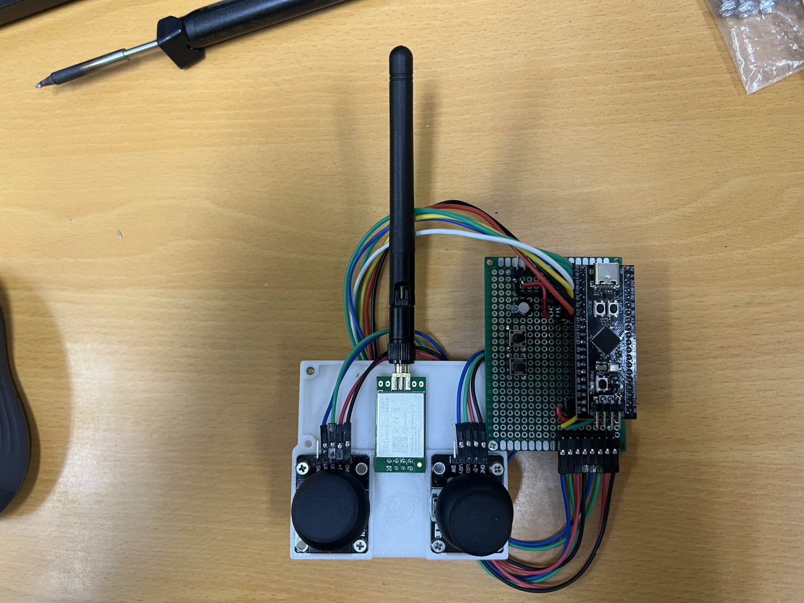
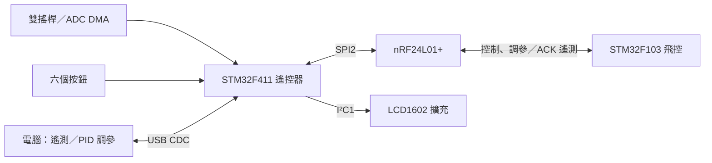
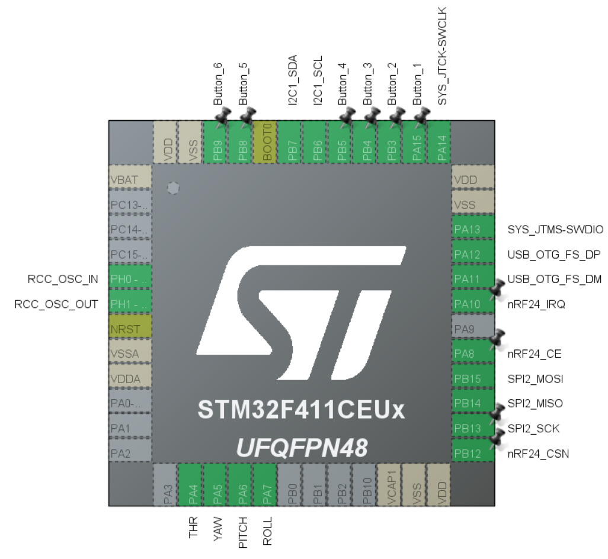

# STM32F411 無線飛控遙控器

**繁體中文** | [English](README.en.md)

以 **STM32F411CEU6、FreeRTOS、nRF24L01+ 與雙搖桿**製作的無線遙控器，搭配 [STM32F103 Flight Controller](https://github.com/ZHANG-XICHANG/stm32f103-flight-controller) 使用。除了傳送四軸操控與按鍵命令，也透過 USB CDC 將飛控遙測傳至電腦，並轉送 PID 調參命令。



## 功能

| 項目 | 目前實作 |
| --- | --- |
| 搖桿輸入 | ADC DMA 讀取四軸，低通濾波、中心死區與數值映射 |
| 按鍵 | 六鍵獨立消抖，Pitch／Roll 微調與低油門解鎖／鎖定命令 |
| 無線控制 | 17-byte 控制封包、自動 ACK、硬體重傳、逾時與 SPI 錯誤復原 |
| 遙測 | 接收 31-byte ACK 遙測，經 USB 輸出姿態、角速度、PID 與四路 PWM |
| 電腦調參 | 轉送 PID 參數與遙測軸選擇命令，回報套用結果或逾時 |
| LCD 擴充 | 韌體支援 I²C LCD1602，顯示 Connected／Disconnected |

本專案包含遙控器韌體；飛控韌體、Python 遙測與調參工具位於上述配套飛控儲存庫。

## 系統架構



| FreeRTOS 任務 | 優先權 | 設定週期 | 職責 |
| --- | --- | --- | --- |
| CommunicationTa | High | 6 ms | 無線初始化、控制／調參傳送與 ACK 接收 |
| JoystickTask | AboveNormal | 6 ms | 搖桿取樣處理及更新遙控資料 |
| ButtonTask | Normal | 10 ms | 按鍵消抖、微調及電源狀態命令 |
| DisplayTask | BelowNormal | 50 ms | 更新 LCD 連線狀態 |
| USBDebugTask | Low1 | 阻塞等待訊息佇列 | 處理 USB 輸出，傳送未成功時等待 1 tick 再試 |

週期為程式設定值，並非實測執行時間或保證封包速率；無線初始化與錯誤復原期間會額外等待。

## 硬體與供電

| 元件 | 數量／配置 |
| --- | --- |
| STM32F411CEU6 最小系統板 | 1，USB Type-C 接口 |
| 億佰 E01-2G4M27D 無線模組 | 1，nRF24L01+ 方案、SPI 介面 |
| 雙軸搖桿模組 | 2，共四路類比輸入 |
| 按鈕 | 6 |
| LCD1602＋PCF8574 I²C 背板 | 韌體支援的擴充，未列入目前實物的基本材料清單 |

作者目前的供電接法：

- 電源線直接接入 F411 最小系統板的 **USB Type-C** 接口。
- E01-2G4M27D 無線模組使用 **5V**。
- 兩個搖桿模組使用 **3.3V**。

依 [E01-2G4M27D 官方產品規格](https://www.ebyte.com/product/449.html)，模組供電範圍為 **2.5～5.5V**，目前使用的 5V 在此範圍內；通訊電平典型值為 **3.3V**，範圍為 2.0～3.6V，SPI／CE／CSN 等訊號使用主控板的 3.3V 邏輯。供電電壓與訊號電平須分開看待，所有模組與主控板共地。

官方列出的 5V 發射電流典型值為 390 mA、最大值為 400 mA；USB 電源、板上 5V 供電路徑及接線需能負擔無線模組與其餘元件的總電流。

### 腳位配置

配置來源：[STM32CubeMX 專案](F411_remote_hal.ioc)、[GPIO 定義](Core/Inc/main.h)。目前使用 25 MHz 外部晶振，系統時鐘為 96 MHz。



| STM32 腳位 | 功能 | 連接對象 |
| --- | --- | --- |
| PA4 | ADC1 IN4／THR | 油門軸類比輸出 |
| PA5 | ADC1 IN5／YAW | 偏航軸類比輸出 |
| PA6 | ADC1 IN6／PITCH | 俯仰軸類比輸出 |
| PA7 | ADC1 IN7／ROLL | 滾轉軸類比輸出 |
| PB13／PB14／PB15 | SPI2 SCK／MISO／MOSI | 無線模組對應訊號 |
| PB12／PA8／PA10 | CSN／CE／IRQ | 無線模組對應訊號 |
| PA15 | Button 1 | Pitch 微調增加 |
| PB3 | Button 2 | Pitch 微調減少 |
| PB4 | Button 3 | Roll 微調增加 |
| PB5 | Button 4 | Roll 微調減少 |
| PB8 | Button 5 | 保留，尚未指定操作 |
| PB9 | Button 6 | 低油門時送出解鎖／鎖定事件 |
| PB6／PB7 | I2C1 SCL／SDA | LCD1602 I²C 背板，100 kHz |
| PA11／PA12 | USB D−／D+ | 板載 USB 接口 |
| PA13／PA14 | SWDIO／SWCLK | SWD 燒錄／除錯介面 |

按鈕使用內部上拉，按下時將對應 GPIO 接至 GND。Button 編號以 GPIO 定義為準，照片未標示實體按鈕編號。

LCD 預設使用 7-bit 位址 `0x27`（HAL 傳入 `0x4E`），背板對應 P0=RS、P1=RW、P2=E、P3=背光、P4～P7=D4～D7。初始化失敗時顯示任務會結束，其餘任務繼續執行。

## 搖桿與按鍵操作

### 搖桿

目前 [joystick.c](Core/Src/joystick.c) 使用以下設定：

- THR：ADC 0～4084 反向映射為 **550～0**，所以目前油門輸出範圍是 **0～550**。
- Yaw／Pitch／Roll：輸出 0～1000，中立值 500；ADC 中心為 2048，中心死區為 ±50。
- 低通濾波：`filtered = 0.8 × previous + 0.2 × input`。

更換搖桿後，需依實測端點、中點與方向調整各軸的 `MIN`、`CENTER`、`MAX` 及映射。韌體尚未提供自動校正與校正值持久化。

### 按鍵

操作在消抖後的**放開事件**觸發；長按不會連續微調。

| 按鍵 | 行為 |
| --- | --- |
| Button 1／2 | Pitch 微調 +10／−10 |
| Button 3／4 | Roll 微調 +10／−10 |
| Button 5 | 尚未使用 |
| Button 6 | 已取得搖桿資料且油門 `< 5` 時，產生一次 `power=1` 事件 |

微調單位是映射後的控制值，並非角度。偏移量保存在 RAM，範圍為 ±1000，套用後輸出限制在 0～1000；重新啟動後歸零。

### 配合飛控啟動

1. 首次接線與操作驗證時拆除槳葉，確認搖桿方向與油門最低值。
2. 啟動飛控並完成其 IMU 校準，再啟動遙控器。
3. 將油門降至最低，Yaw／Pitch／Roll 回到中立，按下並放開 Button 6。
4. 配套飛控在收到 `power=1`、油門 `< 10`，且其餘三軸皆位於 490～510 時允許解鎖；遙控器送出事件的油門門檻更嚴格，為 `< 5`。
5. 飛控處於正常模式時，再於低油門按下並放開 Button 6，可要求回到未解鎖狀態。

Pitch／Roll 微調會影響送往飛控的中立值。`power` 事件由下一次控制封包取走後清零，即使該次傳送失敗也不會由應用層持續重送；不能只憑按鍵操作認定飛控已切換狀態。

LCD 的 Connected 表示近期無線傳送收到 ACK，**不代表飛控已解鎖**。遙控器 300 ms 未收到成功傳送回報即顯示 Disconnected；飛控的失聯判定與後續行為由飛控韌體決定。

## 建置與燒錄

專案提供 CubeMX `.ioc`、CMake 設定，以及 HAL、CMSIS、FreeRTOS、USB Device Library 原始碼。

需要：

- CMake 3.22 以上。
- Ninja。
- Arm GNU Toolchain，讓 `arm-none-eabi-gcc`、`arm-none-eabi-g++` 等工具可由 PATH 找到。
- 修改周邊配置時使用 STM32CubeMX；燒錄可使用 ST-Link 與 STM32CubeProgrammer。

在本專案根目錄執行：

```sh
cmake --preset Debug
cmake --build --preset Debug
```

Release 建置：

```sh
cmake --preset Release
cmake --build --preset Release
```

輸出分別為 `build/Debug/F411_remote_hal.elf` 與 `build/Release/F411_remote_hal.elf`。移動專案或切換工具鏈後，應使用新的建置目錄重新設定。

以 ST-Link 連接 SWDIO、SWCLK、GND，並依燒錄器要求接上目標電壓參考，透過 STM32CubeProgrammer 將 ELF 寫入主控板。Type-C 用於供電及韌體執行時的 USB CDC 通訊；目前程式未提供 USB 韌體更新功能。

## 無線設定與封包

設定集中在 [nRF24L01P.h](Core/Inc/nRF24L01P.h)，兩端必須使用相容配置。

| 項目 | 目前設定 |
| --- | --- |
| RF channel | 40（十進位） |
| 資料速率 | 2 Mbps |
| RF 功率暫存器設定 | 0 dBm；不代表外接功率放大模組的實際輸出 |
| 位址，依程式陣列順序 | `0A 01 06 0E 01`，5 bytes |
| CRC | 2 bytes |
| ACK | 自動 ACK、動態 payload、ACK payload |
| 自動重傳 | 間隔 500 µs，最多 5 次 |
| 控制封包 | 17 bytes |
| PID／軸選擇命令與結果 | 24 bytes |
| 遙測 ACK | 31 bytes；另支援舊版 4-byte 序號 ACK |

### 控制封包

多位元組欄位使用大端序，由 [transmit.c](Core/Src/transmit.c) 逐位元組編碼。

| Byte | 內容 |
| --- | --- |
| 0～2 | 標頭 `AA 55 AA` |
| 3～4 | THR，uint16 |
| 5～6 | Yaw，uint16 |
| 7～8 | Pitch，uint16 |
| 9～10 | Roll，uint16 |
| 11 | `fixheight`，目前按鍵邏輯未產生定高命令 |
| 12 | `power`，單次解鎖／鎖定事件 |
| 13～16 | Byte 0～12 的加總，uint32 |

PID 與遙測格式分別定義於 [pid_wire.h](Core/Inc/pid_wire.h)、[telemetry_wire.h](Core/Inc/telemetry_wire.h)。整理文件時已確認這兩份標頭與配套飛控的本地版本一致；正式配對的 commit／release 尚待記錄，這不代表已驗證所有後續版本的互通。

## 電腦遙測與 PID 調參

使用可傳輸資料的 USB 線連接**遙控器**與電腦，開啟配套飛控儲存庫中的工具。在飛控儲存庫根目錄執行：

```sh
python -m pip install pyserial matplotlib
python pid_tune.py
```

GUI 需要 Tkinter。選擇遙控器的 COM 埠後，可檢視遙測、選擇 X／Y／Z 軸及送出 PID 參數。只有收到 `Applied` 才表示飛控確認套用；參數保存在飛控 RAM，重新上電恢復韌體預設值。

只需曲線與 CSV 記錄時：

```sh
python serial_scope.py --list-ports
python serial_scope.py --port COM3 --csv telemetry_session_01.csv
```

請替換為實際 COM 埠，並避免兩個工具同時開啟同一埠。

USB 使用換行結尾的文字命令：`PID,sequence,id,kp,ki,kd` 與 `AXIS,sequence,axis`。PID 增益以 0.0001 為單位的非負整數表示，axis 為 0／1／2；命令等待期間約每 100 ms 重送，2 秒未完成則回報 TIMEOUT。遙測輸出以 `TEL,` 開頭，舊版序號輸出以 `TEL_SEQ,` 開頭。

完整協定與工具說明見飛控專案的 [PID 調參文件](https://github.com/ZHANG-XICHANG/stm32f103-flight-controller/blob/main/docs/pid_tuning.md) 與 [遙測文件](https://github.com/ZHANG-XICHANG/stm32f103-flight-controller/blob/main/docs/telemetry.md)。

## 測試

主機端測試編譯實際模組，並以 stub 模擬 HAL／RTOS，執行方式見各目錄：

- [nRF24 測試](tests/nrf24/README.md)：傳送、逾時、重傳耗盡、SPI 錯誤注入與 ACK 處理。
- [按鍵與控制封包測試](tests/process_data/README.md)：低油門事件、微調、邊界值與封包編碼。
- [LCD1602 測試](tests/lcd1602/README.md)：初始化、I²C 位元組序列、失敗處理與恢復。

目前測試指令使用 Visual Studio x64 Native Tools Command Prompt 的 MSVC `cl`。主機端測試無法取代實際 RF、電氣接線、USB 傳輸與 RTOS 排程驗證。

## 程式閱讀入口

| 路徑 | 職責 |
| --- | --- |
| [freertos.c](Core/Src/freertos.c) | 任務與週期、無線復原及顯示流程 |
| [joystick.c](Core/Src/joystick.c) | 四軸讀取、濾波、死區與映射 |
| [button.c](Core/Src/button.c)／[process_data.c](Core/Src/process_data.c) | 消抖、按鍵事件、微調與共享控制資料 |
| [nRF24L01P.c](Core/Src/nRF24L01P.c) | SPI 無線驅動 |
| [transmit.c](Core/Src/transmit.c)／[ack_payload.c](Core/Src/ack_payload.c) | 控制封包編碼與 ACK 分流 |
| [pid_command.c](Core/Src/pid_command.c) | USB 命令解析、無線調參與結果回覆 |
| [telemetry.c](Core/Src/telemetry.c)／[host.c](Core/Src/host.c) | 遙測發布與 USB 文字格式 |
| [USB_DEVICE](USB_DEVICE) | USB CDC 介面 |
| [cmake](cmake) | 工具鏈與 CubeMX 建置設定 |
| [images](images) | 實物照片與腳位圖 |

## 已知限制

- Button 5 與定高操作尚未實作；配套飛控也尚未提供可用的定高控制。
- 搖桿校正值仍為程式常數，油門上限目前為 550；微調不會跨重啟保存。
- 解鎖／鎖定事件沒有應用層的狀態確認與持續重送。
- USB 輸出壅塞時可能丟棄遙測；序號缺口不能直接解讀為 RF 丟包率。
- 配套飛控目前在失聯後恢復連線時可自動回到正常模式，尚未要求重新解鎖；使用前需了解飛控端行為。
- 尚待補齊正式配對版本與可重現的實機驗證紀錄。

## 第三方來源與授權狀態

本專案尚未指定自有程式的開源授權，根目錄目前未提供 `LICENSE`。第三方元件的授權文件保留於各自目錄：

- [STM32F4 HAL](Drivers/STM32F4xx_HAL_Driver/LICENSE.txt)
- [CMSIS](Drivers/CMSIS/LICENSE.txt) 與 [STM32F4 Device](Drivers/CMSIS/Device/ST/STM32F4xx/LICENSE.txt)
- [FreeRTOS](Middlewares/Third_Party/FreeRTOS/Source/LICENSE)
- [STM32 USB Device Library](Middlewares/ST/STM32_USB_Device_Library/LICENSE.txt)

`nRF24L01P.c`、`nRF24L01P.h` 與 `nRF24L01P_REG.h` 衍生自億佰 `E01_ACK_DEMO_260612` 範例，保留 `Chengdu Ebyte Electronic Technology Co.Ltd` 版權聲明與作者 `hyh` 資訊，並為本專案調整 HAL／RTOS 介接及錯誤處理。現有原始範例內尚未找到明確的修改與再散布授權條款，仍需確認來源授權；這些檔案目前未宣告為 MIT 或其他開源授權。
